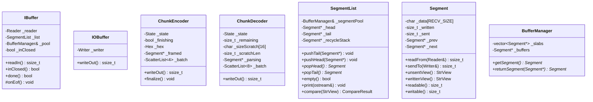

```mermaid
classDiagram
    class IBuffer {
        -Reader _reader
        -SegmentList _list
        -BufferManager& _pool
        -bool _inClosed
        +readIn() ssize_t
        +inClosed() bool
        +done() bool
        #onEof() void
    }
    class IOBuffer {
        -Writer _writer
        +writeOut() ssize_t
    }
    class ChunkEncoder {
        -State _state
        -bool _finishing
        -Hex _hex
        -Segment* _framed
        -ScatterList~4~ _batch
        +writeOut() ssize_t
        +finalize() void
    }
    class ChunkDecoder {
        -State _state
        -size_t _remaining
        -char _sizeScratch[16]
        -size_t _scratchLen
        -Segment* _parsing
        -ScatterList~8~ _batch
        +writeOut() ssize_t
    }
    class SegmentList {
        -BufferManager& _segmentPool
        -Segment* _head
        -Segment* _tail
        -Segment* _recycleStack
        +pushTail(Segment*) void
        +pushHead(Segment*) void
        +popHead() Segment*
        +popTail() Segment*
        +empty() bool
        +print(ostream&) void
        +compare(StrView) CompareResult
    }
    class Segment {
        -char _data[RECV_SIZE]
        -size_t _written
        -size_t _sent
        -Segment* _prev
        -Segment* _next
        +readFrom(Reader&) ssize_t
        +sendTo(Writer&) ssize_t
        +unsentView() StrView
        +writtenView() StrView
        +readable() size_t
        +writable() size_t
    }
    class BufferManager {
        -vector~Segment*~ _slabs
        -Segment* _buffers
        +getSegment() Segment*
        +returnSegment(Segment*) Segment*
    }
```
